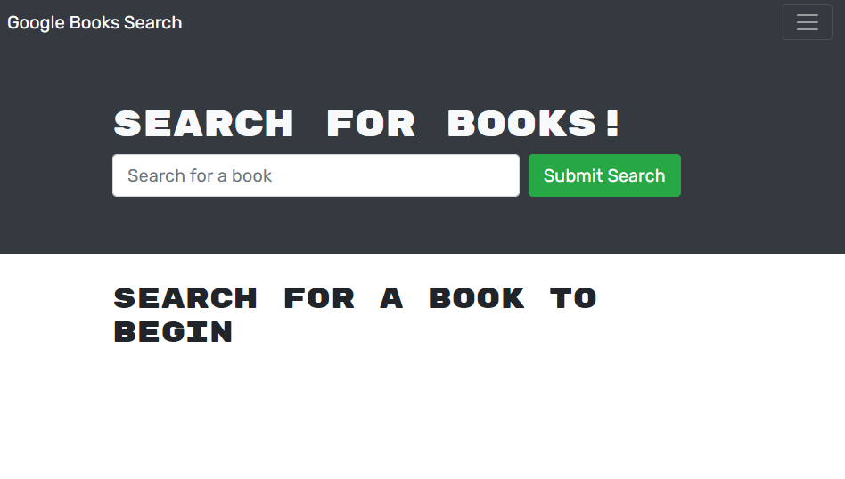

  # Book Search Engine 

  ## Description
  
  A book search engine using Google Books API and a MERN tech stack.
  
  ## Table of Contents
     
  - [Technologies Used](#technologies)
  - [Installation](#installation)
  - [Usage](#usage)
  - [License](#license)
  - [Badges](#badges)
  - [Contribute](#contribute)
  - [Tests](#tests)
  - [Questions](#questions)

  ___
  
  ## Technologies Used
  - [MongoDB Atlas](https://www.mongodb.com/cloud/atlas)
  - [NPM Mongoose Package](https://www.npmjs.com/package/mongoose)
  - [NPM Express.js Package](https://www.npmjs.com/package/express)
  - [NPM React Package](https://www.npmjs.com/package/react)
  - [Node.js](https://nodejs.org/en/)
  - [NPM GraphQL Package](https://www.npmjs.com/package/graphql)
  - [NPM React-Bootstrap](https://www.npmjs.com/package/react-bootstrap)

  ## Installation
  
  Installation isn't necessary to utilize the application. If you would like to save the project locally, clone the repository here: [repository](https://github.com/RJimenezTech/book-search-engine).
  
  ## Usage
  
  Visit the application here: [Google Book Search Engine](https://rjimeneztech-book-search.herokuapp.com/)

  From the main page of the application, select the options bar on the right-hand side. You can select Login/Signup to create an account.

  
  
  Enter an email, username, and password to create an account. You will not be able to access all the application functionality withouth an account.

  

  From the search bar, enter the title of a book you would like to search for. You can scroll down and to find a button to save individual books to you Saved Books list. 

  

  From the menu, you can select See you Books and be displayed all the books in your collection. 
  

  Visit the application here: [Google Book Search Engine](https://rjimeneztech-book-search.herokuapp.com/)
  
  ## License 

  This project is licensed under the [MIT License](https://opensource.org/licenses/MIT)
  
  
  ## Contribute
  
  Contact me for contributions.
  
  ## Tests
  
  No testing required at this time.

  ## Questions
  
  Find me at [rjimeneztech](https://github.com/rjimeneztech) on GitHub for more information.
  Email me directly at rjimeneztech@gmail.com.
